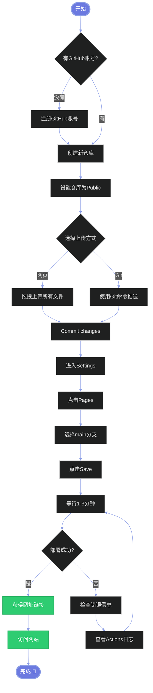

# 🚀 GitHub Pages 部署指南

## 📋 目录
1. [准备工作](#准备工作)
2. [创建GitHub仓库](#创建github仓库)
3. [上传代码](#上传代码)
4. [配置GitHub Pages](#配置github-pages)
5. [访问网站](#访问网站)
6. [常见问题](#常见问题)

---

## 🎯 准备工作

### 需要的工具
- ✅ GitHub账号（免费）
- ✅ Git工具（可选，也可以用网页上传）
- ✅ 你的项目文件（当前文件夹的所有内容）

### 检查文件清单
确保你的文件夹包含：
```
礼物盒子/
├── index.html              ✅ 主页面
├── style.css               ✅ 样式文件
├── script.js               ✅ 脚本文件
├── history.html            ✅ 历史页面
├── 描绘画面 (1).png        ✅ 盲盒封面1
├── 描绘画面 (2).png        ✅ 盲盒封面2
├── 描绘画面 (3).png        ✅ 盲盒封面3
├── 描绘画面 (5).png        ✅ 背景图
├── 补给站.jpg              ✅ 补给站插图
└── Hv1p6wAtu6hIOGXBjtzbo.png ✅ Kitty头像
```

---

## 📦 创建GitHub仓库

### 方法一：网页创建（推荐新手）

#### 步骤1：登录GitHub
访问 [https://github.com](https://github.com) 并登录

#### 步骤2：创建新仓库
1. 点击右上角 `+` 号
2. 选择 `New repository`
3. 填写信息：
   - **Repository name**: `love-lottery`（或其他喜欢的名字）
   - **Description**: `恋爱能量抽奖系统`
   - **Public** ✅（必须选择Public才能用免费的GitHub Pages）
   - ⚠️ **不要**勾选 "Add a README file"
4. 点击 `Create repository`

#### 步骤3：上传文件
1. 在新建的仓库页面，点击 `uploading an existing file`
2. 将所有文件拖拽到上传区域（或点击选择文件）
3. 确保上传以下文件：
   ```
   index.html
   history.html
   style.css
   script.js
   描绘画面 (1).png
   描绘画面 (2).png
   描绘画面 (3).png
   描绘画面 (5).png
   补给站.jpg
   Hv1p6wAtu6hIOGXBjtzbo.png
   ```
4. 在底部填写提交信息：`Initial commit - 恋爱抽奖系统`
5. 点击 `Commit changes`

---

### 方法二：使用Git命令行（适合有经验的用户）

```bash
# 1. 进入项目文件夹
cd "D:\Users\yuew3\Desktop\礼物盒子"

# 2. 初始化Git仓库
git init

# 3. 添加所有文件
git add .

# 4. 提交
git commit -m "Initial commit - 恋爱抽奖系统"

# 5. 添加远程仓库（替换YOUR_USERNAME和YOUR_REPO）
git remote add origin https://github.com/YOUR_USERNAME/YOUR_REPO.git

# 6. 推送到GitHub
git branch -M main
git push -u origin main
```

---

## ⚙️ 配置GitHub Pages

### 步骤1：打开设置
1. 在你的仓库页面，点击顶部的 `Settings`（设置）
2. 在左侧菜单找到 `Pages`（在 Code and automation 部分）

### 步骤2：配置发布源
1. 在 **Source** 下拉菜单中选择 `Deploy from a branch`
2. 在 **Branch** 下拉菜单中：
   - 选择 `main`（或 `master`）
   - 文件夹选择 `/ (root)`
3. 点击 `Save` 保存

### 步骤3：等待部署
- GitHub会自动构建你的网站
- 通常需要 **1-3分钟**
- 页面上方会显示绿色提示：`Your site is live at https://YOUR_USERNAME.github.io/YOUR_REPO/`

---

## 🌐 访问网站

### 你的网站地址
```
https://YOUR_USERNAME.github.io/YOUR_REPO/
```

例如，如果你的用户名是 `yuew3`，仓库名是 `love-lottery`，那么网址就是：
```
https://yuew3.github.io/love-lottery/
```

### 分享给Ta
你可以把这个网址发给你的另一半，Ta在任何设备上打开都能看到！

---

## 🔄 更新网站

### 如果需要修改内容

#### 方法A：网页直接编辑
1. 在GitHub仓库页面，点击要修改的文件
2. 点击右上角的 ✏️（编辑）按钮
3. 修改内容后，滚动到底部
4. 填写提交信息，点击 `Commit changes`
5. 等待1-2分钟，网站自动更新

#### 方法B：上传新文件
1. 在仓库页面点击 `Add file` → `Upload files`
2. 拖拽新文件覆盖旧文件
3. 提交更改
4. 等待自动部署

#### 方法C：使用Git命令
```bash
# 修改文件后
git add .
git commit -m "更新说明"
git push
```

---

## 🎨 部署流程图



---

## 🔍 常见问题

### Q1: 网站显示404错误
**A:** 检查以下几点：
- ✅ 确认文件名是 `index.html`（小写）
- ✅ 确认仓库是 Public
- ✅ 确认GitHub Pages已启用
- ✅ 等待3-5分钟再试

### Q2: 图片不显示
**A:** 可能的原因：
- ❌ 图片文件名有中文或空格
- ❌ 图片没有上传成功
- ✅ 检查HTML中的图片路径是否正确

**解决方案**：
```html
<!-- 确保路径正确，使用相对路径 -->

```

### Q3: CSS样式没有生效
**A:** 检查：
- ✅ `style.css` 文件已上传
- ✅ `index.html` 中的 `<link>` 标签路径正确
- ✅ 清除浏览器缓存（Ctrl+F5）

### Q4: 修改后网站没更新
**A:** 
1. 等待2-3分钟（GitHub需要重新构建）
2. 清除浏览器缓存（Ctrl+Shift+R）
3. 检查 Actions 标签页查看部署状态

### Q5: 想绑定自己的域名
**A:** 
1. 购买域名（如：`love.example.com`）
2. 在域名提供商处添加CNAME记录
3. 在GitHub Pages设置中填写自定义域名
4. 详见：[GitHub自定义域名文档](https://docs.github.com/en/pages/configuring-a-custom-domain-for-your-github-pages-site)

### Q6: 想设置为私有仓库
**A:** 
- ❌ 免费账号的Private仓库无法使用GitHub Pages
- ✅ 升级到GitHub Pro（学生可免费申请）
- ✅ 或使用其他部署方案（Netlify、Vercel）

---

## 🎯 部署检查清单

部署前确认：
- [ ] 所有文件已上传
- [ ] 仓库设置为Public
- [ ] index.html在根目录
- [ ] GitHub Pages已启用
- [ ] 选择了main分支
- [ ] 等待了3-5分钟

部署后测试：
- [ ] 网站能正常打开
- [ ] 图片全部显示
- [ ] 样式正确加载
- [ ] 点击功能正常
- [ ] 在手机上测试
- [ ] 在不同浏览器测试

---

## 🌟 其他免费部署平台

如果不想用GitHub Pages，还有以下选择：

### 1. Netlify（推荐）
- 🌐 [https://www.netlify.com](https://www.netlify.com)
- ✅ 更快的部署速度
- ✅ 自动HTTPS
- ✅ 支持拖拽上传
- ✅ 更好的自定义域名支持

### 2. Vercel
- 🌐 [https://vercel.com](https://vercel.com)
- ✅ 超快部署
- ✅ 优秀的CDN
- ✅ 支持GitHub集成

### 3. Cloudflare Pages
- 🌐 [https://pages.cloudflare.com](https://pages.cloudflare.com)
- ✅ 全球CDN
- ✅ 无限带宽
- ✅ 支持GitHub集成

---

## 📱 移动端访问优化

你的网站已经是响应式设计，在手机上访问体验很好！

分享给Ta时可以说：
> 💕 我给你做了一个专属的恋爱抽奖系统  
> 在手机或电脑上打开这个网址：  
> https://你的用户名.github.io/仓库名/  
> 记得收藏到主屏幕哦！

### 添加到主屏幕（PWA效果）
**iOS：**
1. 在Safari中打开网站
2. 点击底部分享按钮
3. 选择"添加到主屏幕"

**Android：**
1. 在Chrome中打开网站
2. 点击菜单按钮（三个点）
3. 选择"添加到主屏幕"

---

## 💡 进阶技巧

### 添加自定义域名示例
如果你有域名 `love.example.com`：

1. 在域名DNS设置中添加：
   ```
   Type: CNAME
   Name: love
   Value: YOUR_USERNAME.github.io
   ```

2. 在GitHub Pages设置中填写：
   ```
   Custom domain: love.example.com
   ```

3. 勾选 `Enforce HTTPS`

---

## 📞 需要帮助？

- 📖 GitHub Pages官方文档：[https://docs.github.com/pages](https://docs.github.com/pages)
- 💬 GitHub社区：[https://github.community](https://github.community)
- 🎓 Git教程：[https://www.liaoxuefeng.com/wiki/896043488029600](https://www.liaoxuefeng.com/wiki/896043488029600)

---

## 🎉 完成！

恭喜！你已经成功将恋爱抽奖系统部署到网上了！

现在可以：
- 🔗 把网址发给Ta
- 📱 在任何设备上访问
- 💾 数据保存在浏览器本地
- 🎨 随时修改内容

**祝你们越来越甜蜜！** 💖

---

**最后更新**：2025年10月17日  
**版本**：1.0


