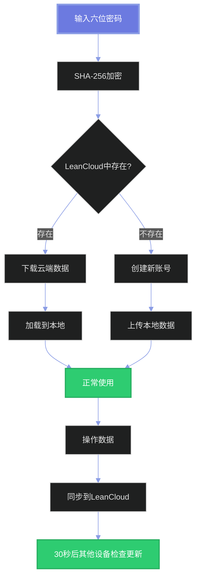
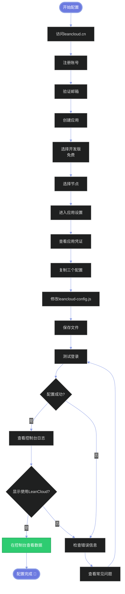

# ☁️ LeanCloud 云端同步配置指南

## 📋 目录
1. [功能说明](#功能说明)
2. [注册LeanCloud账号](#注册leancloud账号)
3. [创建应用](#创建应用)
4. [获取配置信息](#获取配置信息)
5. [修改配置文件](#修改配置文件)
6. [测试云端同步](#测试云端同步)
7. [常见问题](#常见问题)

---

## 🌟 功能说明

使用LeanCloud云端同步，您将获得：

✅ **跨设备同步**：在任何设备上登录相同密码，自动加载您的数据
✅ **实时更新**：30秒自动检查更新
✅ **数据备份**：数据存储在LeanCloud云端，永不丢失
✅ **国内访问快**：服务器在中国，访问速度快
✅ **无需实名**：只需邮箱注册，不需要身份验证

### 工作原理



---

## 🚀 注册LeanCloud账号

### 步骤1：访问官网

打开浏览器，访问：[https://www.leancloud.cn/](https://www.leancloud.cn/)

### 步骤2：注册账号

1. 点击右上角 **"注册"** 按钮
2. 填写信息：
   - **邮箱地址**：填写您的常用邮箱
   - **密码**：设置一个账号密码（不是您的六位数字密码）
   - **用户名**：随意填写
3. 勾选 **"同意服务条款"**
4. 点击 **"注册"**

### 步骤3：验证邮箱

1. 打开您的邮箱
2. 找到LeanCloud发来的验证邮件
3. 点击邮件中的验证链接
4. 验证完成！

> 💡 **提示**：整个注册过程约3分钟，无需实名认证

---

## 📦 创建应用

### 步骤1：登录控制台

验证邮箱后，自动跳转到控制台
或访问：[https://console.leancloud.cn/](https://console.leancloud.cn/)

### 步骤2：创建应用

1. 点击 **"创建应用"** 按钮
2. 填写应用信息：
   - **应用名称**：例如 `gift-box` 或 `我的礼物盒`
   - **选择计费方案**：选择 **"开发版"**（免费）
3. 点击 **"创建"**

### 步骤3：选择节点

选择 **"华北节点"** 或 **"华东节点"**
推荐选择离您更近的节点

> 💡 **免费额度**：
> - API请求：30,000次/天
> - 数据存储：1 GB
> - 完全够个人使用！

---

## 🔑 获取配置信息

### 步骤1：进入应用设置

1. 在控制台，点击刚创建的应用
2. 进入应用后，点击左侧菜单的 **"设置"**
3. 选择 **"应用凭证"**

### 步骤2：查看配置信息

您会看到三个重要信息：

#### AppID
```
类似这样的格式：
AbCdEfGh123456-xxxxxxx
```

#### AppKey
```
类似这样的格式：
1234567890abcdefghijklmn
```

#### 服务器地址（REST API）
```
类似这样的格式：
https://abcdefgh.lc-cn-n1-shared.com
```

**⚠️ 重要**：复制这三个信息，稍后需要用到！

### 步骤3：创建数据表（可选）

LeanCloud会在首次使用时自动创建数据表，您也可以手动创建：

1. 点击左侧菜单的 **"数据存储"** → **"结构化数据"**
2. 点击 **"创建Class"**
3. 输入表名：`UserData`
4. 权限设置：全部勾选
5. 点击 **"创建"**

> 💡 这一步可以跳过，系统会自动创建

---

## ⚙️ 修改配置文件

### 步骤1：打开配置文件

打开项目中的 `leancloud-config.js` 文件

### 步骤2：替换配置

**修改前：**
```javascript
const leanCloudConfig = {
  appId: "YOUR_APP_ID",
  appKey: "YOUR_APP_KEY",
  serverURL: "https://YOUR_APP_ID.lc-cn-n1-shared.com"
};
```

**修改后（示例）：**
```javascript
const leanCloudConfig = {
  appId: "AbCdEfGh123456-xxxxxxx",
  appKey: "1234567890abcdefghijklmn",
  serverURL: "https://abcdefgh.lc-cn-n1-shared.com"
};
```

> ⚠️ **注意**：请替换为您自己的配置信息，不要使用示例中的值！

### 步骤3：保存文件

保存 `leancloud-config.js` 文件

---

## 🧪 测试云端同步

### 测试步骤

#### 1. 首次登录

- 打开 `login.html`
- 输入任意六位密码（例如：`123456`）
- 系统会自动创建账号并上传数据
- 控制台应该显示：`🌐 使用LeanCloud`

#### 2. 验证云端数据

- 打开LeanCloud控制台
- 进入 **"数据存储"** → **"结构化数据"**
- 查看 `UserData` 表
- 应该能看到一条记录，包含您的数据

#### 3. 跨设备测试

- 清除浏览器缓存或使用无痕模式
- 重新打开网站
- 输入相同的六位密码
- 数据应该自动加载

#### 4. 同步测试

- 在设备A添加能量
- 等待30秒
- 在设备B刷新页面
- 数据应该已经同步

### 预期结果

✅ 登录页面显示 "登录成功！"
✅ 控制台显示 "🌐 使用LeanCloud"
✅ 控制台显示 "✅ LeanCloud初始化成功"
✅ 控制台显示 "✅ 云端同步已启用"
✅ 每次操作后显示 "☁️ 数据已同步到云端"

---

## 🆚 LeanCloud vs Firebase

| 特性 | LeanCloud | Firebase |
|------|-----------|----------|
| 国内访问速度 | ⭐⭐⭐⭐⭐ 很快 | ⭐⭐ 较慢 |
| 实名认证 | ❌ 不需要 | ❌ 不需要 |
| 文档语言 | 🇨🇳 中文 | 🇺🇸 英文 |
| 免费额度 | ⭐⭐⭐⭐ | ⭐⭐⭐⭐⭐ |
| 实时同步 | ⚠️ 30秒轮询 | ✅ 实时 |
| 稳定性 | ⭐⭐⭐⭐ | ⭐⭐⭐⭐⭐ |
| 配置难度 | ⭐⭐ 简单 | ⭐⭐ 简单 |

**推荐**：国内用户建议使用LeanCloud

---

## ❓ 常见问题

### Q1: 提示 "LeanCloud未配置"

**A:** 检查以下几点：
- ✅ 确认已修改 `leancloud-config.js`
- ✅ 确认配置信息正确（没有 `YOUR_APP_ID` 等占位符）
- ✅ 刷新页面重新加载

### Q2: 提示 "网络错误"

**A:** 可能的原因：
- 检查网络连接
- 确认LeanCloud服务正常
- 查看浏览器控制台的详细错误信息

### Q3: 数据没有同步

**A:** 
1. 打开浏览器控制台（F12）
2. 查看是否有错误信息
3. 确认是否显示 "✅ 云端同步已启用"
4. 检查LeanCloud控制台是否有数据
5. 等待30秒（LeanCloud使用轮询同步）

### Q4: 为什么不是实时同步？

**A:** 
- LeanCloud免费版不支持实时通信（LiveQuery）
- 系统使用30秒轮询检查更新
- 对于个人使用完全够用
- 如需实时同步，可以升级LeanCloud商用版

### Q5: 想切换回Firebase怎么办？

**A:** 
1. 修改 `leancloud-config.js`，改回占位符
2. 配置 `firebase-config.js`
3. 系统会自动使用Firebase

### Q6: 可以同时配置两个吗？

**A:** 
- 系统会优先使用LeanCloud
- 如果LeanCloud未配置，自动切换到Firebase
- 不建议同时使用（数据会不一致）

### Q7: 免费额度够用吗？

**A:** 
- ✅ 30,000次请求/天
- ✅ 假设每分钟操作一次，一天也只需1440次
- ✅ 完全够用，还有很大余量！

### Q8: 数据会永久保存吗？

**A:** 
- ✅ 只要LeanCloud账号正常
- ✅ 没有超过免费额度
- ✅ 应用没有被删除
- 💡 建议定期导出数据备份

---

## 📊 配置完成检查清单

部署前确认：
- [ ] 已注册LeanCloud账号
- [ ] 已创建应用
- [ ] 已获取配置信息（AppID、AppKey、服务器地址）
- [ ] 已修改 `leancloud-config.js`
- [ ] 已测试登录功能
- [ ] 控制台显示"云端同步已启用"
- [ ] 在LeanCloud控制台能看到数据

---

## 🎯 配置流程图



---

## 💡 使用技巧

### 技巧1：查看数据使用情况

1. 进入LeanCloud控制台
2. 点击 **"统计"** → **"数据统计"**
3. 查看API请求次数和存储使用量

### 技巧2：设置数据权限

1. 进入 **"数据存储"** → **"结构化数据"**
2. 选择 `UserData` 表
3. 点击右上角 **"权限"**
4. 可以设置读写权限

### 技巧3：导出云端数据

1. 进入 `UserData` 表
2. 点击 **"导出"** 按钮
3. 选择JSON或CSV格式
4. 定期备份到本地

---

## 📞 需要帮助？

- 📖 LeanCloud官方文档：[https://docs.leancloud.cn/](https://docs.leancloud.cn/)
- 💬 LeanCloud社区：[https://forum.leancloud.cn/](https://forum.leancloud.cn/)
- 📧 工单支持：在控制台右下角点击"客服"

---

## 🎉 完成！

恭喜！您已经成功配置LeanCloud云端同步！

现在您可以：
- 🌐 在任何设备上访问数据
- 🔄 自动同步所有操作
- 💾 永久保存记忆和礼物
- 🚀 享受国内快速访问

**祝您使用愉快！** 💖

---

**最后更新**：2025年10月20日
**版本**：1.0 - LeanCloud版

