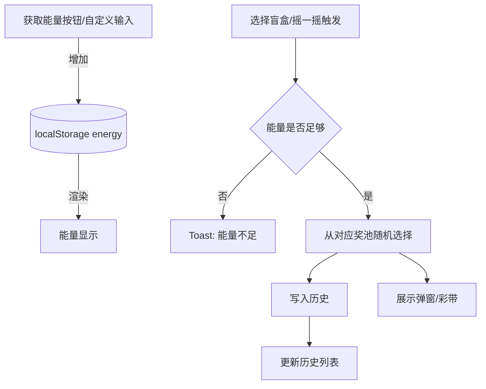
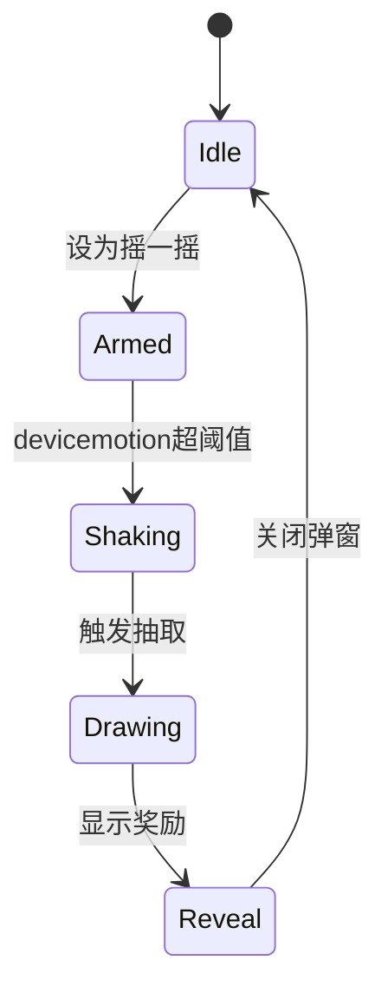

## Hello Kitty 惊喜盲盒

一个为女朋友定制的可爱抽奖网页，包含 Hello Kitty 主题、能量系统、三款盲盒、摇一摇开启、3D 动画与彩带庆祝效果。双击或手机摇一摇即可抽出浪漫惊喜。

### 运行方式
- 直接双击打开 `index.html` 即可（无需服务端）。

### 功能说明
- 获取能量：点击预设奖励或输入自定义数值，能量会存入浏览器本地（`localStorage`）。
- 三款盲盒：
  - 甜心小确幸（10 能量）
  - 心动宝贝（25 能量）
  - 浪漫时光盒子（50 能量）
- 摇一摇：点击某个盲盒下方“设为摇一摇”，授权后摇晃手机即可开启。
- 历史记录：每次抽取都会记录时间、消耗与奖励，可清空。

### 设计原则与原理
- 轻前端，无依赖；状态（能量/历史/摇一摇目标）以 `localStorage` 持久化。
- CSS 变量统一主题色；3D 盒盖使用 `transform-origin` + `rotateX` 动画模拟开启。
- 摇一摇：基于 `devicemotion` 的加速度变化阈值与冷却时间检测。

### 结构图（Mermaid）

### 状态机（Mermaid）

### 调整素材
- 本项目已使用你提供的图片 `Hv1p6wAtu6hIOGXBjtzbo.png`，建议添加更多 Hello Kitty PNG（透明背景）到根目录或 `assets/` 目录，并在 `index.html` 或 `style.css` 中作为背景/角标使用。

### 10 条测试用例与预期
1. 点击“亲亲 +3”，能量应+3，显示数值增加。
2. 输入“10”并点击“添加”，能量应+10。
3. 能量不足时点击“浪漫时光盒子”抽取，应出现提示“能量不足，需要 50”。
4. 能量≥10时点击“甜心小确幸”，能量减少10，弹出奖励弹窗。
5. 连续两次点击“甜心小确幸”，历史列表应新增2条记录，时间逆序显示。
6. 点击某盲盒“设为摇一摇”，按钮样式变为高亮，状态持久化。
7. 授权后摇动手机，若已设定盲盒，则触发抽取并播放开盖动画。
8. 抽取弹窗点击“再来一次”，在能量充足时应再次抽取同一盲盒。
9. 点击“清空历史”，历史列表清空且本地存储相应更新。
10. 刷新页面后，能量/历史/摇一摇选择应保持（已持久化）。

