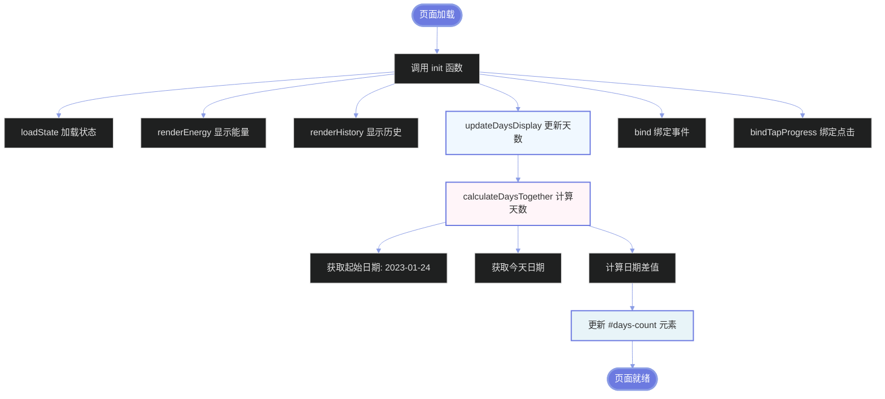
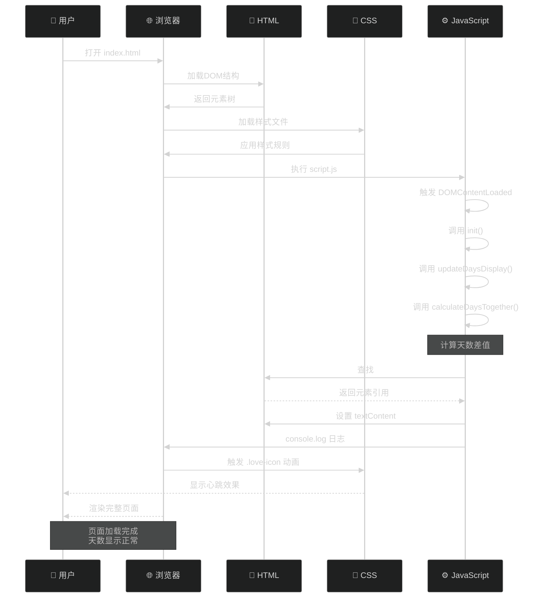
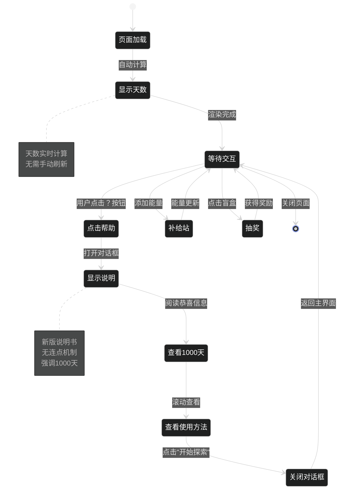
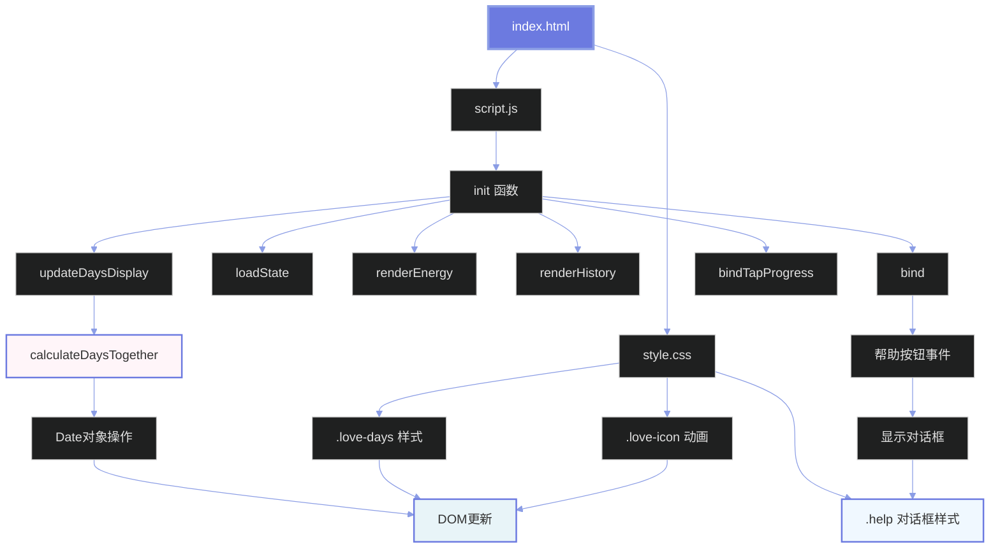
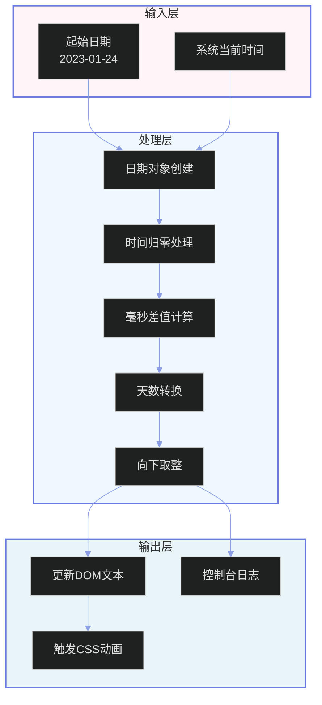
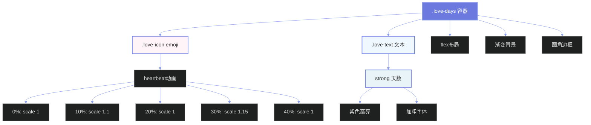

# 功能实现原理图

## 📊 整体架构流程



## 💞 天数计算详细流程

```mermaid
%%{init: {'theme':'dark', 'themeVariables': { 'primaryColor':'#6c7ae0','primaryTextColor':'#fff','primaryBorderColor':'#8b9de5','lineColor':'#8b9de5','secondaryColor':'#f0f8ff','tertiaryColor':'#fff5f9','textColor':'#e0e0e0','fontSize':'16px'}}}%%
flowchart LR
    A[开始计算] --> B[创建起始日期对象<br/>2023-01-24]
    B --> C[创建今天日期对象]
    C --> D[归零时间部分<br/>setHours 0,0,0,0]
    D --> E[计算时间差<br/>today - startDate]
    E --> F[转换为天数<br/>除以86400000ms]
    F --> G[向下取整<br/>Math.floor]
    G --> H[更新DOM显示]
    H --> I[输出日志]
    I --> J[完成]
    
    style A fill:#6c7ae0,stroke:#8b9de5,stroke-width:2px,color:#fff
    style D fill:#fff5f9,stroke:#6c7ae0,stroke-width:2px,color:#333
    style G fill:#f0f8ff,stroke:#6c7ae0,stroke-width:2px,color:#333
    style H fill:#e8f4f8,stroke:#6c7ae0,stroke-width:2px,color:#333
    style J fill:#6c7ae0,stroke:#8b9de5,stroke-width:2px,color:#fff
```



## 🎨 前端渲染流程



## 📱 用户交互流程



## 🔧 模块依赖关系



## 🎯 数据流向图



## 🎬 动画时间轴

```mermaid
%%{init: {'theme':'dark', 'themeVariables': { 'primaryColor':'#6c7ae0','primaryTextColor':'#fff','primaryBorderColor':'#8b9de5','lineColor':'#8b9de5','secondaryColor':'#f0f8ff','tertiaryColor':'#fff5f9','textColor':'#e0e0e0','fontSize':'16px'}}}%%
gantt
    title 心跳动画时间轴 (1.5秒循环)
    dateFormat SSS
    axisFormat %L ms
    
    section 动画帧
    scale(1.0)        :000, 150ms
    scale(1.1)        :150, 50ms
    scale(1.0)        :200, 100ms
    scale(1.15)       :300, 50ms
    scale(1.0)        :350, 1150ms
    
    section 视觉效果
    正常大小          :000, 150ms
    第一次放大        :150, 50ms
    恢复              :200, 100ms
    第二次放大(更大)  :300, 50ms
    保持稳定          :350, 1150ms
```



## 📐 CSS样式层次结构



---

## 💡 核心原理总结

### 1. 日期计算原理
```javascript
// 时间差计算公式
天数 = Math.floor((今天 - 起始日期) / (1000 * 60 * 60 * 24))
```

### 2. DOM更新机制
- 单次计算：页面加载时执行一次
- 安全检查：更新前验证元素存在
- 性能优化：无需定时刷新

### 3. 动画实现方式
- CSS @keyframes：硬件加速
- animation属性：无限循环
- transform：性能最优

### 4. 样式设计思路
- 粉蓝渐变：浪漫温馨
- 紫色主色：品牌一致
- 心跳动画：情感共鸣

---

**文档版本**: 1.0  
**最后更新**: 2025年10月17日


