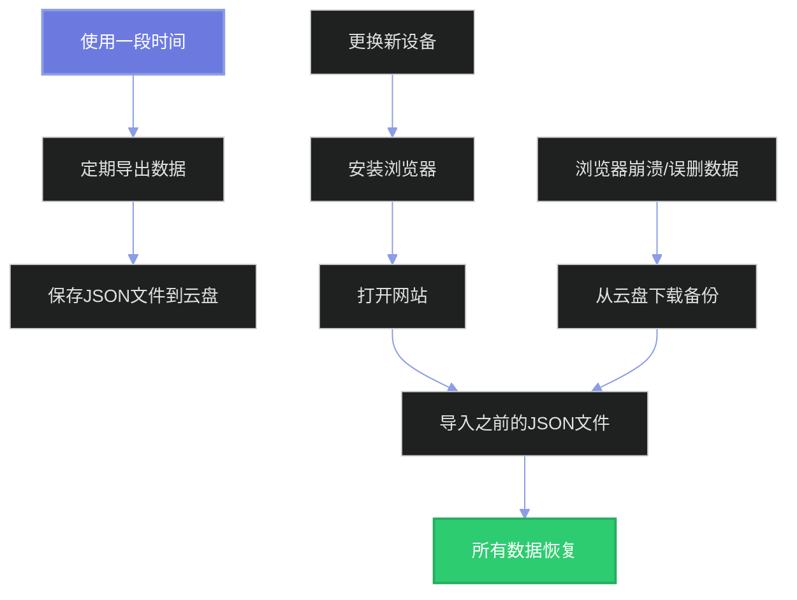

# 💾 本地存储备份方案

## 📋 不使用云同步时的数据保存方法

如果您选择不配置Firebase云端同步，系统提供以下保存和备份方案：

---

## 🔧 方案一：浏览器本地存储（自动）

### 工作原理

系统会自动将所有数据保存在浏览器的 `localStorage` 中：
- ✅ 能量数值
- ✅ 抽取历史记录
- ✅ 自定义奖池配置
- ✅ 其他设置

### 优点
- ✅ 完全自动，无需手动操作
- ✅ 速度快，即时保存
- ✅ 不需要网络连接
- ✅ 完全私密，数据不会上传

### 缺点
- ❌ 只在当前浏览器有效
- ❌ 清除浏览器数据会丢失
- ❌ 无法跨设备访问
- ❌ 重装系统后会丢失

### 使用建议
定期使用下面的备份方法导出数据，以防意外丢失。

---

## 📤 方案二：CSV导出（已有功能）

### 如何使用

1. 打开 **"与你的记忆"** 页面（history.html）
2. 点击右上角的 **"导出 ⬇️"** 按钮
3. 系统会下载一个 CSV 文件：`kitty-history.csv`

### 导出内容

CSV文件包含所有历史记录：
```csv
时间,类型,内容,消耗
2025-10-20 12:34,甜心小确幸,早安拥抱券,10
2025-10-20 10:15,恋爱能量,+50｜今天很开心,0
...
```

### 优点
- ✅ 可以用Excel打开查看
- ✅ 方便统计分析
- ✅ 可以打印保存
- ✅ 适合长期归档

### 缺点
- ❌ 只导出历史记录
- ❌ 不包含能量和奖池配置
- ❌ 导入回去比较麻烦

---

## 💾 方案三：完整数据备份（推荐新增）

### 建议实现功能

我可以为您添加一个**完整数据备份**功能：

#### 导出功能
- 点击"导出完整数据"按钮
- 下载一个JSON文件，包含：
  - 当前能量值
  - 所有历史记录
  - 自定义奖池配置
  - 其他设置

#### 导入功能
- 点击"导入数据"按钮
- 选择之前导出的JSON文件
- 自动恢复所有数据

### 使用场景



---

## 🎯 推荐备份策略

### 日常使用
- 📱 依赖浏览器本地存储（自动）
- 🔒 避免清除浏览器数据

### 定期备份
- 📅 每周或每月导出一次完整数据
- ☁️ 保存到云盘（百度网盘、OneDrive等）
- 📧 或发送到自己的邮箱

### 重要操作前
- 🔧 重装系统前：先导出数据
- 🌐 更换浏览器前：先导出数据
- 🧹 清理浏览器前：先导出数据

---

## 💡 各方案对比

| 方案 | 优点 | 缺点 | 推荐度 |
|-----|------|------|--------|
| 浏览器本地存储 | 自动保存 | 容易丢失 | ⭐⭐⭐ |
| CSV导出 | 可读性强 | 不完整 | ⭐⭐⭐ |
| JSON完整备份 | 功能完整 | 需手动操作 | ⭐⭐⭐⭐⭐ |
| Firebase云同步 | 全自动跨设备 | 需配置 | ⭐⭐⭐⭐⭐ |

---

## 🚀 您需要我实现完整备份功能吗？

我可以立即为您添加：

### 功能一：导出完整数据
```
主页添加按钮：
[📥 导出完整数据]

点击后下载：
kitty-backup-2025-10-20.json
```

### 功能二：导入数据
```
主页添加按钮：
[📤 导入数据]

选择文件后：
自动恢复所有数据
```

### 功能三：自动提醒备份
```
使用一段时间后提醒：
"💡 建议导出数据备份，以防丢失"
```

---

## 📊 不同场景的最佳方案

### 场景1：只在一台电脑使用
**推荐方案**：本地存储 + 定期JSON备份
- 日常使用：自动保存
- 每月：导出一次JSON文件到云盘

### 场景2：多设备使用
**推荐方案**：Firebase云同步
- 一次配置，永久同步
- 不用担心数据问题

### 场景3：担心数据丢失
**推荐方案**：JSON备份 + 云盘
- 每次使用后导出数据
- 自动上传到云盘

### 场景4：和Ta一起使用
**推荐方案**：
- 选项A：共用同一个密码（推荐）
- 选项B：定期用JSON文件同步数据

---

## 🔧 立即实现建议

如果您需要，我可以马上为您添加：

1. **完整数据导出功能**（5分钟）
   - 在主页添加"导出数据"按钮
   - 下载包含所有数据的JSON文件

2. **数据导入功能**（5分钟）
   - 在主页添加"导入数据"按钮
   - 选择JSON文件恢复数据

3. **自动备份提醒**（3分钟）
   - 使用一定次数后提醒备份
   - 可关闭提醒

4. **备份到剪贴板**（2分钟）
   - 点击按钮复制数据
   - 可以粘贴到记事本保存

---

## ❓ 您想要哪个功能？

请告诉我您的需求：
- A. 添加完整数据导出导入功能
- B. 只要导出功能就够了
- C. 添加自动提醒功能
- D. 我还是想用云同步

我会立即为您实现！💪

