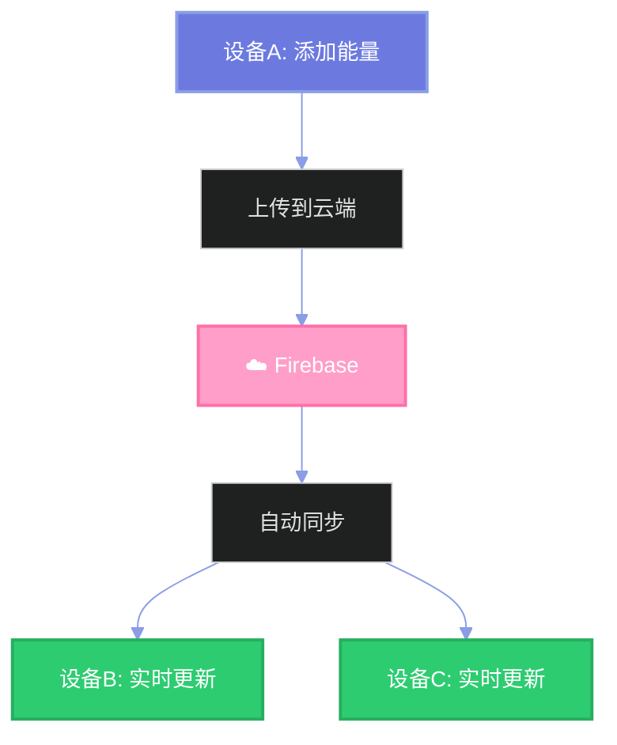

# 🔐 账号功能使用说明

## 🎉 新增功能概览

您的Hello Kitty惊喜盲盒现在支持**账号功能**和**云端同步**啦！

### ✨ 核心功能

1. **六位密码保护** 🔒
   - 进入网站需要输入六位数字密码
   - 密码经过SHA-256加密，安全可靠
   - 自动记住登录状态

2. **跨设备数据同步** ☁️
   - 更换设备或IP也能保留所有数据
   - 能量、历史记录、自定义奖池全部同步
   - 实时更新，多设备同时使用无冲突

3. **设置密码保护** 🛡️
   - 点击设置按钮需要验证密码
   - 防止误操作修改奖池配置

4. **登出功能** 🚪
   - 随时退出登录
   - 保护隐私安全

---

## 📖 使用教程

### 🚀 首次使用

#### 步骤1：设置密码

1. 打开网站，会自动跳转到登录页面
2. 输入一个**六位数字密码**（例如：`123456`）
3. 系统会自动创建账号并保存您的本地数据到云端


**💡 密码建议：**
- ✅ 选择容易记住的数字
- ✅ 可以是纪念日（如：`0124` 代表1月24日）
- ✅ 建议使用密码管理器保存
- ⚠️ 忘记密码无法找回，请务必牢记

#### 步骤2：正常使用

登录后即可正常使用所有功能：
- 添加能量 ⚡
- 开启盲盒 🎁
- 查看历史 📒
- 自定义奖池 ⚙️

---

### 🌐 跨设备使用

#### 在新设备上登录

1. 在任何设备上打开网站
2. 输入**相同的六位密码**
3. 系统自动从云端加载您的数据
4. 所有历史记录、能量、奖池配置完美同步

#### 数据同步示意图



**✨ 实际场景：**
- 📱 在手机上添加能量 → 💻 电脑上立即显示
- 💻 在电脑上开盲盒 → 📱 手机上实时更新历史
- 🏢 在公司修改奖池 → 🏠 在家打开就是最新配置

---

### ⚙️ 修改设置

#### 访问设置需要密码验证

1. 点击右上角的 **⚙️ 设置** 按钮
2. 弹出密码验证对话框
3. 输入您的六位密码
4. 验证成功后才能进入设置页面

**🛡️ 为什么需要密码验证？**
- 防止他人随意修改您精心设置的奖池
- 避免误操作导致配置丢失
- 增加一层安全保护

---

### 🚪 退出登录

#### 如何退出

1. 点击右上角的 **红色"退出"** 按钮
2. 确认退出
3. 自动跳转到登录页面

**💡 什么时候需要退出？**
- 在公共设备上使用后
- 想切换到另一个账号
- 保护隐私安全

**⚠️ 注意：**
- 退出后需要重新输入密码才能访问
- 数据仍然保存在云端，不会丢失
- 重新登录后数据会自动恢复

---

## 🔧 Firebase云端配置（可选）

### 为什么需要配置Firebase？

如果不配置Firebase：
- ✅ 系统仍然可以正常使用
- ✅ 数据保存在浏览器本地
- ❌ 无法跨设备同步
- ❌ 清除浏览器数据会丢失

配置Firebase后：
- ✅ 数据存储在Google云端
- ✅ 跨设备自动同步
- ✅ 永久保存，不怕丢失
- ✅ 实时更新

### 如何配置？

请参考 **`FIREBASE_SETUP.md`** 文档，里面有详细的图文教程：

1. 创建Firebase项目（5分钟）
2. 启用Firestore数据库（3分钟）
3. 获取配置信息（2分钟）
4. 修改配置文件（1分钟）
5. 测试云端同步（2分钟）

**总计：约15分钟完成配置**

---

## 💡 使用技巧

### 技巧1：创建有意义的密码

```
示例：
- 0124 = 1月24日（在一起的日子）
- 5201 = 520 我爱你
- 1314 = 一生一世
```

### 技巧2：多设备配合使用

```
场景：
📱 手机 → 随时随地添加能量
💻 电脑 → 舒适地配置奖池
📱 平板 → 和Ta一起开盲盒
```

### 技巧3：定期备份

虽然有云端同步，建议定期导出数据：
1. 进入"与你的记忆"页面
2. 点击"导出 ⬇️"按钮
3. 保存CSV文件到本地

### 技巧4：密码管理

推荐使用密码管理器保存密码：
- 1Password
- LastPass
- Bitwarden
- 浏览器内置密码管理器

---

## ❓ 常见问题

### Q1: 忘记密码怎么办？

**A:** 由于密码就是账号的唯一标识：
- ❌ 无法找回密码
- ✅ 可以创建新密码（但会创建新账号，旧数据无法访问）
- 💡 **强烈建议牢记密码或使用密码管理器！**

### Q2: 可以修改密码吗？

**A:** 目前不支持修改密码，因为密码即账号ID。
如果需要更换密码：
1. 在旧密码下导出所有数据
2. 使用新密码登录（创建新账号）
3. 手动导入数据

### Q3: 数据会丢失吗？

**A:** 不会！数据有双重保护：
- ✅ 本地浏览器存储
- ✅ Firebase云端备份
- 💡 除非同时清除浏览器数据和删除Firebase项目

### Q4: 多个设备同时操作会冲突吗？

**A:** 不会！
- ✅ Firebase自动处理冲突
- ✅ 最后的操作会生效
- ✅ 其他设备会实时更新

### Q5: 数据安全吗？

**A:** 非常安全！
- ✅ 密码经过SHA-256加密
- ✅ 数据存储在Google云端
- ✅ Firebase有专业的安全防护
- ✅ 每个账号的数据完全独立

### Q6: 免费吗？

**A:** 完全免费！
- ✅ Firebase免费额度对个人使用绰绰有余
- ✅ 存储：1 GB
- ✅ 读取：50,000 次/天
- ✅ 写入：20,000 次/天

### Q7: 可以多人共用一个账号吗？

**A:** 可以！
- ✅ 分享密码给Ta
- ✅ Ta在自己的设备上输入相同密码
- ✅ 就能看到相同的数据
- 💡 非常适合情侣一起使用！

### Q8: 在隐私模式下可以使用吗？

**A:** 可以，但有限制：
- ✅ 登录功能正常
- ✅ 云端同步正常
- ❌ 关闭浏览器后需要重新登录
- 💡 建议在正常模式下使用

---

## 📊 功能对比

### 配置前 vs 配置后

| 功能 | 未配置Firebase | 配置Firebase后 |
|------|--------------|---------------|
| 基本使用 | ✅ 正常 | ✅ 正常 |
| 数据保存 | ✅ 本地存储 | ✅ 本地+云端 |
| 跨设备同步 | ❌ 不支持 | ✅ 自动同步 |
| 更换IP | ❌ 数据丢失 | ✅ 自动恢复 |
| 清除缓存 | ❌ 数据丢失 | ✅ 自动恢复 |
| 实时更新 | ❌ 不支持 | ✅ 实时同步 |
| 数据备份 | ❌ 需手动导出 | ✅ 自动备份 |

---

## 🎯 快速开始清单

### 初次使用

- [ ] 打开网站
- [ ] 设置六位密码
- [ ] 登录成功
- [ ] 添加能量测试
- [ ] 开一个盲盒
- [ ] 查看历史记录

### 启用云端同步

- [ ] 阅读 `FIREBASE_SETUP.md`
- [ ] 创建Firebase项目
- [ ] 配置Firestore数据库
- [ ] 修改 `firebase-config.js`
- [ ] 测试登录
- [ ] 验证数据同步

### 跨设备使用

- [ ] 在新设备打开网站
- [ ] 输入相同密码
- [ ] 验证数据已同步
- [ ] 在新设备添加能量
- [ ] 在旧设备查看更新

---

## 🎨 界面说明

### 登录页面

```
┌─────────────────────────┐
│         🎀              │
│ Hello Kitty 惊喜盲盒     │
│ 请输入您的六位密码        │
│                         │
│  ▢  ▢  ▢  ▢  ▢  ▢      │
│                         │
│  1   2   3              │
│  4   5   6              │
│  7   8   9              │
│ 清空  0  删除            │
│                         │
│ 💡 首次使用请设置密码     │
│ 🔐 数据将加密存储        │
│ 🌐 跨设备访问数据        │
└─────────────────────────┘
```

### 密码验证对话框

```
┌─────────────────────────┐
│      🔐 验证密码         │
│ 请输入您的六位密码以继续  │
│                         │
│  [  ●  ●  ●  ●  ●  ●  ] │
│                         │
│   [ 取消 ]  [ 确认 ]    │
└─────────────────────────┘
```

---

## 📞 需要帮助？

### 文档资源

- 📖 **Firebase配置**: `FIREBASE_SETUP.md`
- 🚀 **部署指南**: `DEPLOYMENT.md`
- 📋 **项目说明**: `README.md`

### 技术支持

- 💬 遇到问题可以查看浏览器控制台（F12）
- 🔍 查看Console中的日志信息
- 📧 记录错误信息以便排查

---

## 🎉 开始使用吧！

现在您已经了解了所有功能，赶快试试吧！

1. 🔐 设置一个容易记住的密码
2. ☁️ 配置Firebase启用云端同步
3. 🎁 开始您的浪漫惊喜之旅

**祝您使用愉快！** 💖

---

**最后更新**：2025年10月20日  
**版本**：2.0 - 账号功能版

