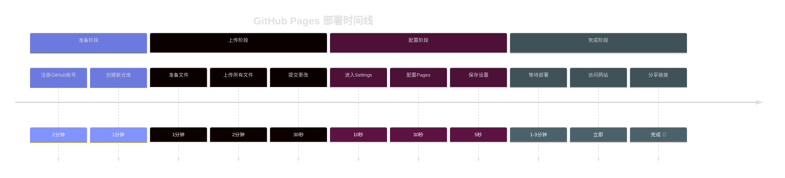
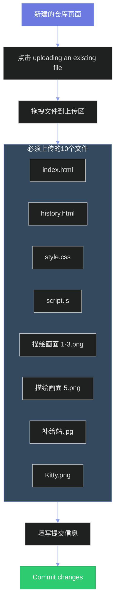
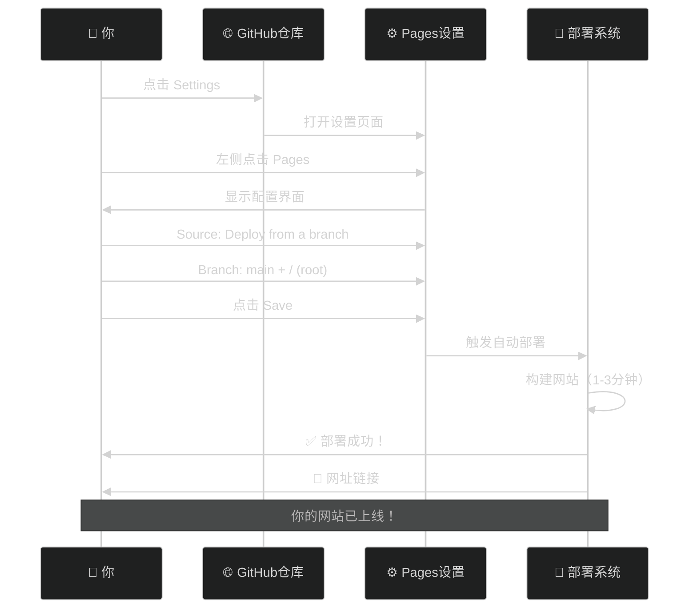
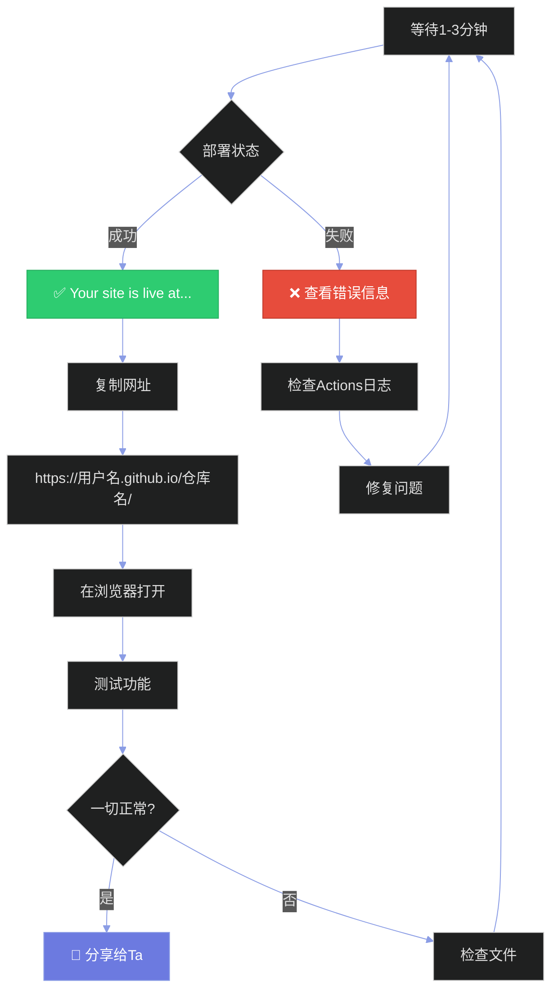
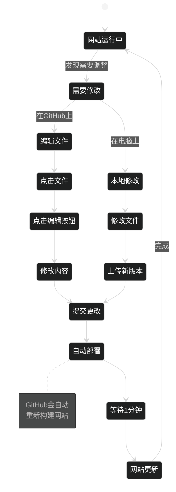
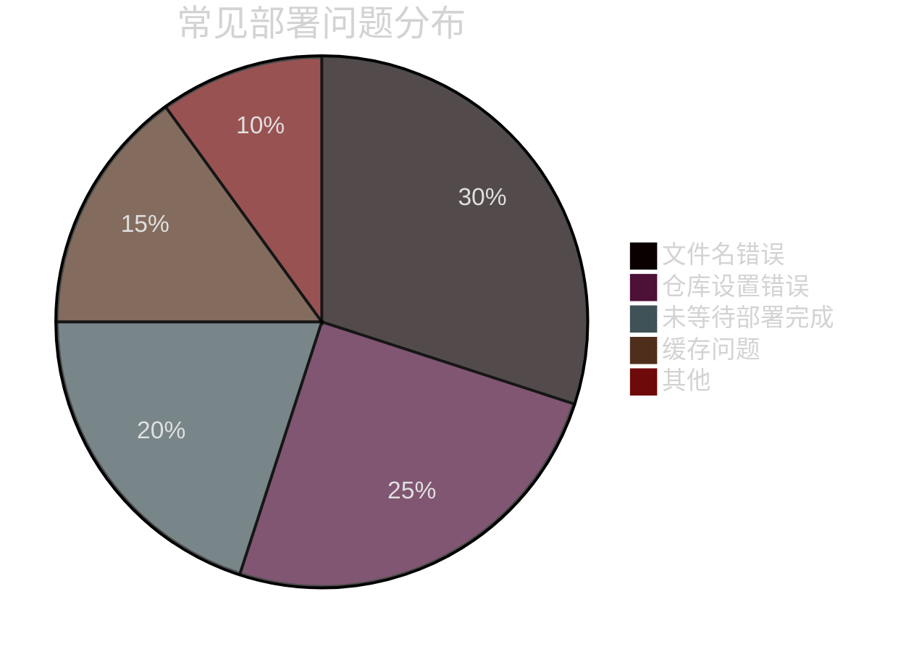
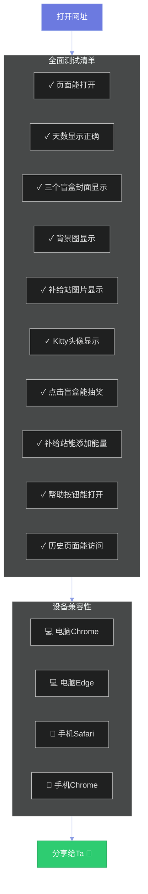
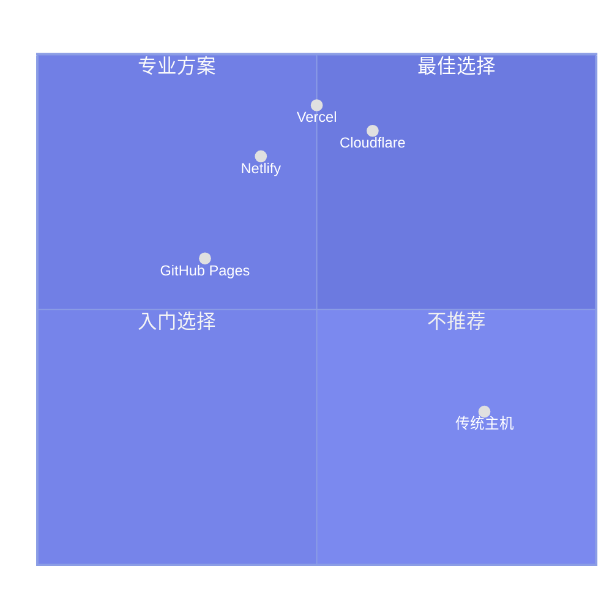

# 📸 GitHub Pages 部署步骤图解

## 🎯 整体流程一览



---

## 📋 步骤详解

### 🔹 步骤1：创建仓库


**关键信息填写：**
```
Repository name:  love-lottery  ✅
Description:      恋爱能量抽奖系统
Public:           ● 选中  ✅
README:           ☐ 不勾选
```

---

### 🔹 步骤2：上传文件



**上传确认清单：**
```
☑ index.html              (主页面)
☑ history.html            (历史页面)
☑ style.css               (样式文件)
☑ script.js               (脚本文件)
☑ 描绘画面 (1).png         (盲盒封面1)
☑ 描绘画面 (2).png         (盲盒封面2)
☑ 描绘画面 (3).png         (盲盒封面3)
☑ 描绘画面 (5).png         (背景图)
☑ 补给站.jpg              (补给站插图)
☑ Hv1p6wAtu6hIOGXBjtzbo.png (Kitty头像)
```

---

### 🔹 步骤3：配置Pages



**配置截图说明：**
```
┌─────────────────────────────────────┐
│  Pages                              │
├─────────────────────────────────────┤
│                                     │
│  Source                             │
│  ┌─────────────────────────────┐   │
│  │ Deploy from a branch      ▼ │   │
│  └─────────────────────────────┘   │
│                                     │
│  Branch                             │
│  ┌──────────┐ ┌──────────────┐     │
│  │ main   ▼ │ │ / (root)   ▼ │     │
│  └──────────┘ └──────────────┘     │
│                                     │
│  [       Save       ]               │
│                                     │
└─────────────────────────────────────┘
```

---

### 🔹 步骤4：获取网址



**网址格式：**
```
https://你的GitHub用户名.github.io/仓库名/
       ↑                            ↑
    你的用户名                   你创建的仓库名
    
例如：
https://yuew3.github.io/love-lottery/
```

---

## 🔄 更新流程图



---

## 📊 部署成功率分析



**问题预防：**
```
✅ 文件名检查        → index.html (小写)
✅ 仓库设置         → Public (公开)
✅ 等待时间         → 3-5分钟
✅ 清除缓存         → Ctrl+F5
✅ 路径检查         → 使用相对路径
```

---

## 🎯 访问测试流程



---

## 💡 一键部署总结卡片

```
╔═══════════════════════════════════════════╗
║   🚀 GitHub Pages 一键部署              ║
╠═══════════════════════════════════════════╣
║                                           ║
║  时间： 5分钟                             ║
║  费用： 免费 💰                           ║
║  难度： ⭐⭐☆☆☆                          ║
║                                           ║
║  步骤：                                   ║
║  1️⃣  创建仓库        [1分钟]            ║
║  2️⃣  上传文件        [2分钟]            ║
║  3️⃣  启用Pages       [1分钟]            ║
║  4️⃣  等待部署        [1-3分钟]          ║
║                                           ║
║  结果：                                   ║
║  ✅ 永久免费托管                          ║
║  ✅ 全球CDN加速                           ║
║  ✅ HTTPS安全访问                         ║
║  ✅ 随时更新内容                          ║
║                                           ║
║  网址格式：                               ║
║  https://用户名.github.io/仓库名/        ║
║                                           ║
╚═══════════════════════════════════════════╝
```

---

## 🎁 额外福利

### 🌐 备用部署方案对比



### 📈 功能完善度

| 平台 | 免费额度 | 部署速度 | CDN | 自定义域名 | 推荐度 |
|------|---------|---------|-----|-----------|-------|
| **GitHub Pages** | ✅ 无限 | ⭐⭐⭐ | ✅ | ✅ | ⭐⭐⭐⭐⭐ |
| **Netlify** | ✅ 100GB/月 | ⭐⭐⭐⭐⭐ | ✅ | ✅ | ⭐⭐⭐⭐⭐ |
| **Vercel** | ✅ 100GB/月 | ⭐⭐⭐⭐⭐ | ✅ | ✅ | ⭐⭐⭐⭐⭐ |
| **Cloudflare** | ✅ 无限 | ⭐⭐⭐⭐ | ✅ | ✅ | ⭐⭐⭐⭐ |

---

## 🎊 恭喜完成部署！

现在你可以：
- 📱 在任何设备访问
- 🔗 分享给心爱的Ta
- 💾 数据自动保存
- 🎨 随时修改更新
- 💖 记录甜蜜时光

**祝你们爱情甜蜜，每天都有小惊喜！** 🎉

---

**文档版本**：1.0  
**创建日期**：2025年10月17日  
**适用平台**：GitHub Pages


